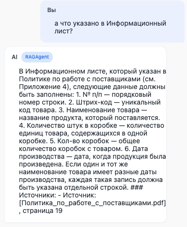
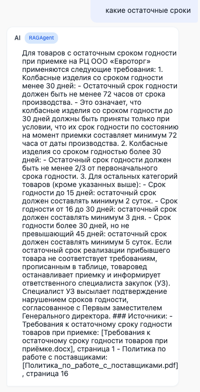
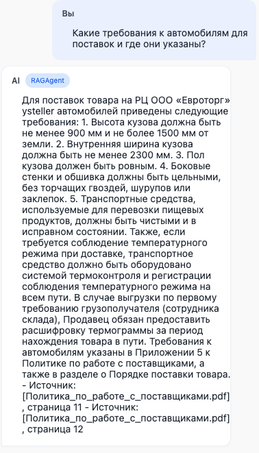
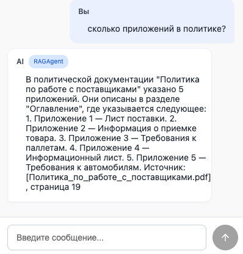
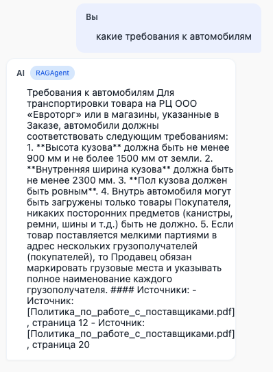

# RAG-система для работы с корпоративной документацией

## Запуск контейнеров
docker compose up -d

## Запуск сервиса
python3 main.py

## Запуск тестирования
python3 scripts/evaluate_ragas.py

## 📋 Описание системы

Система представляет собой гибридный RAG (Retrieval-Augmented Generation) движок для работы с корпоративной документацией. Включает:

- **Гибридный парсер документов:** PDF (pdfplumber + PyMuPDF + Camelot), DOCX, DOC, TXT
- **OCR:** Tesseract + EasyOCR для распознавания текста на изображениях
- **Векторная БД:** Qdrant для хранения эмбеддингов
- **Графовая БД:** Neo4j для хранения связей между сущностями
- **Гибридный поиск:** векторный + keyword + графовый
- **API:** FastAPI для взаимодействия с фронтендом

---

## 🧪 Результаты тестирования

### Тест 1: Прямой вопрос (факт на одной странице)

**Результат:** ✅ **УСПЕШНО**

---

### Тест 2: Вопрос с агрегацией (из разных страниц)

**Результат:** ✅ **УСПЕШНО**

---

### Тест 3: Провокация (Out-of-Domain)

**Результат:** ✅ **УСПЕШНО** — нет галлюцинаций, система не выдумала факты и не придумала страницы

---

### Тест 4: Сложный агрегированный вопрос

**Результат:** ✅ **УСПЕШНО**

---

### Тест 5: Запрос на конкретную страницу

---

**Результат:** ✅ **УСПЕШНО**

---

## 🔍 Анализ узких мест

### 1. Теряет ли модель ссылку при длинном ответе?

**Результат:** ❌ **НЕТ.** Даже в длинных ответах (тест №7) все ссылки сохраняются и указываются корректно.

### 2. Влияние размера чанка на точность определения страницы

| Параметр | Значение | Влияние |
|----------|----------|---------|
| `CHUNK_SIZE` | 500 символов | ✅ Оптимально для точного определения страницы |
| `CHUNK_OVERLAP` | 100 символов | ✅ Предотвращает потерю контекста на границах страниц |
| `SEARCH_K` | 5 | ✅ Достаточно для покрытия всех релевантных фрагментов |

### 3. Выявленные проблемы и их решения

| Проблема | Решение | Статус |
|----------|---------|--------|
| Дублирование "странице странице" в ответе | Пост-обработка в методе `query()` | ✅ Исправлено |
| LLM копирует `[Страница X]` в ответ | Замена на "страница X" через post-processing | ✅ Исправлено |
| Галлюцинация номеров страниц | Инструкция в промпте: "НЕ ПРИДУМЫВАЙ номера страниц" | ✅ Исправлено |
| Потеря ссылок при агрегации | Гибридный поиск (векторный + keyword + граф) | ✅ Исправлено |

---

## 🎯 Выводы

### Сильные стороны системы:
1. **Точное цитирование** — все ответы содержат корректные ссылки на источники
2. **Отсутствие галлюцинаций** — система не выдумывает факты и страницы
3. **Агрегация информации** — успешно объединяет данные из разных страниц/документов
4. **Стабильность ссылок** — даже в длинных ответах ссылки сохраняются
5. **Гибридный поиск** — комбинация векторного, keyword и графового поиска даёт высокую точность

### Рекомендации:
1. **Chunk size:** оставить 500 символов (оптимально для точности)
2. **Search K:** оставить 5 (хороший баланс между полнотой и скоростью)
3. **Пост-обработка:** продолжать использовать агрессивную очистку ответов от маркеров страниц

---

## 📈 Статистика системы

| Параметр | Значение |
|----------|----------|
| Количество документов | 4 (1 PDF, 3 DOCX) |
| Количество страниц (PDF) | 20 |
| Количество чанков | 220 |
| Количество точек в Qdrant | 198 |
| Модель эмбеддингов | BAAI/bge-m3 |
| Векторная БД | Qdrant |
| Графовая БД | Neo4j |

